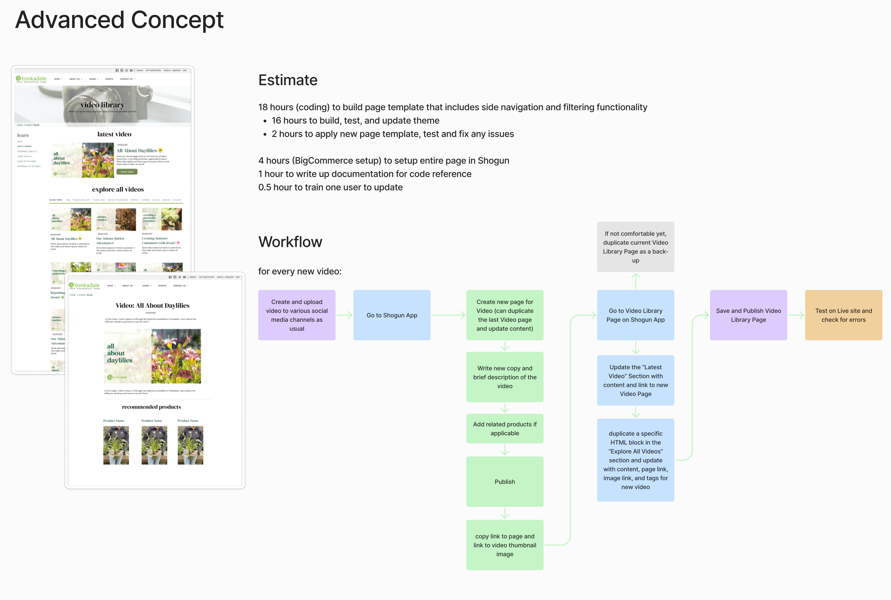
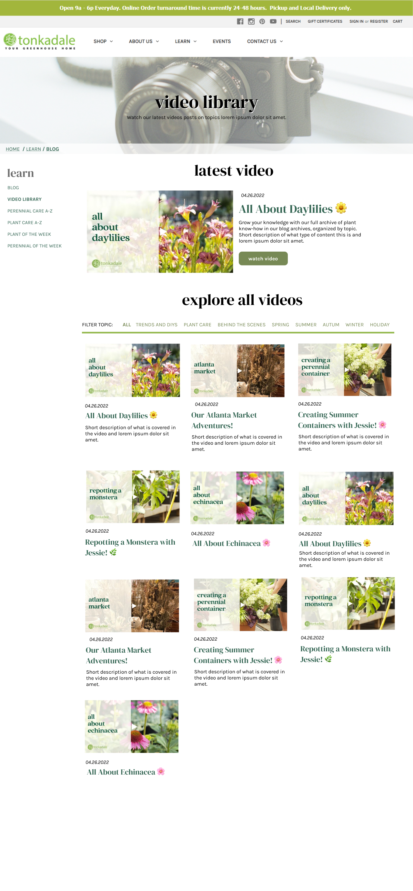
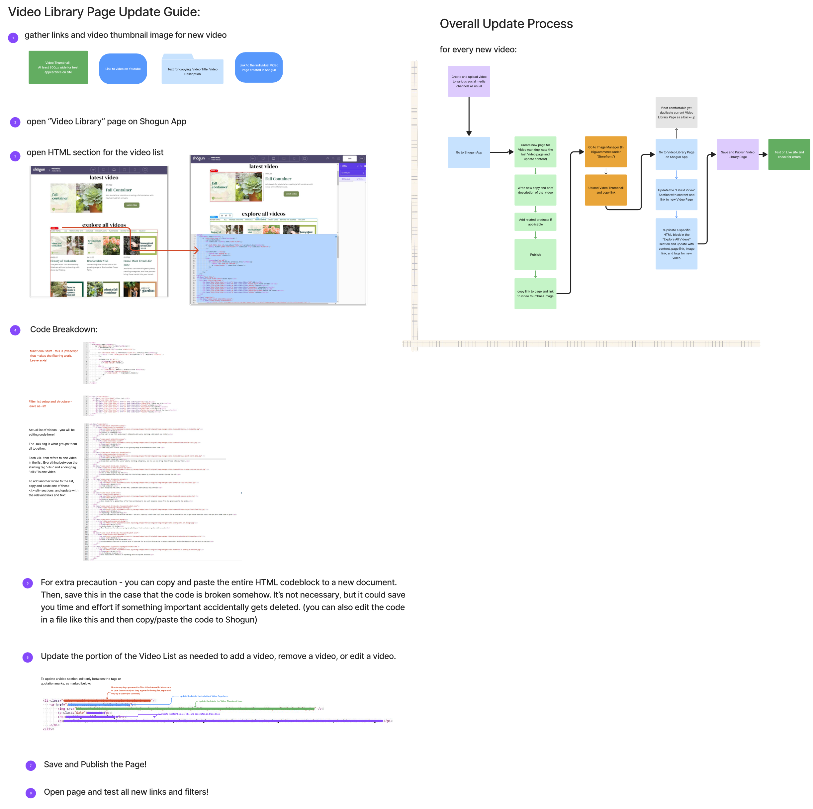

# SASS Example: A Video Library Page for a Greenhouse
This repository exists to share samples of code created for 
a freelance client. 


# Project Background
The client's website is built using the BigCommerce platform. They've requested additional features that aren't part of BigCommerce's functionality - in this case, a video library page with simple filters to view and browse their video educational content. This functionality had to be placed within the WYSIWYG editor of the Page Builder Plugin they are using to create content: Shogun Page Builder, so they could access it to make changes without a developer.

To assist with the client making their own updates, I delivered this page setup in Shogun, along with a tutorial document for them to follow along while updating. I also worked with them in virtual training sessions to work through the first examples together.

<details>
<summary>Original Estimate</summary>



</details>
<details>
<summary>Full Concept Visual Design</summary>



</details>
<details>
<summary>Update Guide Document</summary>



</details>
<br>

Visuals were created using Figma.

# Current Page
The current site is mostly maintained by the client and non-developer editors, but is located [here](https://tonkadale.com/video-library) for preview.

# The HTML structure

```html
<ul class="list-filter">
    <li class="list-filter-label">Filter topic:</li>
    <ul class="list-filter-items">
        <li class="list-filter-item"><a href="#" data-video-filter="all">All</a></li>
        <li class="list-filter-item"><a href="#" data-video-filter="trends-diys">Trends and DIYs</a></li>
        <li class="list-filter-item"><a href="#" data-video-filter="annuals">Annuals</a></li>
        <li class="list-filter-item"><a href="#" data-video-filter="perennials">Perennials</a></li>
        <li class="list-filter-item"><a href="#" data-video-filter="houseplants">Houseplants</a></li>
        <li class="list-filter-item"><a href="#" data-video-filter="plant-care">Plant Care</a></li>
        <li class="list-filter-item"><a href="#" data-video-filter="behind-the-scenes">Behind the Scenes</a></li>
        <li class="list-filter-item"><a href="#" data-video-filter="holiday">Holiday</a></li>
    </ul>            
</ul>
<ul class="video-list">
    <li class="video-result holiday trends-diys">
        <a href="https://tonkadale.com/video-spruce-top-pots-with-jessie-2022">
            
            <p class="date">11.04.22</p>
            <h4>Spruce Top Pots with Jessie</h4>
            <p>Deck-orate the Halls! With our spruce top tutorials!</p>
        </a>
    </li>
    <li class="video-result houseplants">
        <a href="/video-orchid-collections">
            
            <p class="date">10.21.22</p>
            <h4>Orchid Collections and Varieties</h4>
            <p>Explore the beauty of orchids!</p>
        </a>
    </li>
    <li class="video-result houseplants plant-care">
        <a href="/video-neem-oil">
            
            <p class="date">10.14.22</p>
            <h4>Protect and Shine with Neem Oil</h4>
            <p>Jessie shares how to care for your plants going into the winter season using her favorite neem oil products.</p>
        </a>
    </li>
    <li class="video-result houseplants">
        <a href="/video-talking-houseplants">
            
            <p class="date">09.30.22</p>
            <h4>Talking Houseplants with Hayden &amp; Hannah</h4>
            <p>Hayden and Hannah share their favorite newest arrivals!</p>
        </a>
    </li>
    <li class="video-result holiday annuals">
        <a href="/video-hot-fall-tips">
            
            <p class="date">09.23.22</p>
            <h4>Hot Fall Tips</h4>
            <p>Check out Jessie's top hot tips for the fall season!</p>
        </a>
    </li>
    <li class="video-result trends-diys">
        <a href="/video-jessie-visits-khaluna">
            
            <p class="date">09.16.22</p>
            <h4>Jessie Visits Kh&acirc;luna</h4>
            <p>Join Jessie this week to talk plants with Chef Ann Ahmed, owner and founder of Khaluna, a Southeast Asian inspired restaurant here in Minneapolis.</p>
        </a>
    </li>
    <li class="video-result houseplants trends-diys">
        <a href="/video-jessies-plant-picks-for-dorm-and-office">
            
            <p class="date">09.02.22</p>
            <h4>Jessie's Plant Picks for Dorm &amp; Office</h4>
            <p>Watch as Jessie guides us through planty recommendations for your dorm and office space.</p>
        </a>
    </li>
    <li class="video-result trends-diys annuals">
        <a href="/video-fall-container-2022">
            
            <p class="date">08.26.22</p>
            <h4>Fall Container</h4>
            <p>Join Jessie for a tutorial on creating a fall container with newly arrived fall annuals.</p>
        </a>
    </li>
    <li class="video-result behind-the-scenes">
        <a href="/video-history-of-tonkadale">
            
            <p class="date">04.22.22</p>
            <h4>History of Tonkadale</h4>
            <p>This year is our 75th anniversary! Celebrate with us by learning a bit about our history.</p>
        </a>
    </li>
    <li class="video-result behind-the-scenes">
        <a href="/video-breckendale-visit">
            
            <p class="date">04.15.22</p>
            <h4>Breckendale Visit</h4>
            <p> Come along on a virtual tour of our growing range at Breckendale Flower Farm.</p>
        </a>
    </li>
    <li class="video-result trends-diys houseplants">
        <a href="/video-house-plant-trends-2022">
            
            <p class="date">01.07.22</p>
            <h4>House Plant Trends for 2022</h4>
            <p>Jessie lets us know this years' planty trending categories, and how you can bring these trends into your home!.</p>
        </a>
    </li>
    <li class="video-result trends-diys holiday">
        <a href="/video-how-to-make-a-spruce-top-pot">
            
            <p class="date">11.05.21</p>
            <h4>How to Make a Spruce Top Pot</h4>
            <p>Jessie demonstrates how to get ready for the holiday season by creating the perfect Spruce Top Pot.</p>
        </a>
    </li>
    <li class="video-result trends-diys annuals">
        <a href="/video-fall-containers">
            
            <p class="date">09.02.21</p>
            <h4>Fall Containers</h4>
            <p>Join Jessie as she plants a fresh fall container with classic fall annuals!</p>
        </a>
    </li>
    <li class="video-result plant-care">
        <a href="/video-jessies-garden">
            
            <p class="date">07.23.21</p>
            <h4>Jessie’s Garden</h4>
            <p>Join Jessie for a guided tour of her home and backyard. See what inspires Jessie from the greenhouse to the garden.</p>
        </a>
    </li>
    <li class="video-result trends-diys houseplants plant-care">
        <a href="/video-repotting-a-fiddle-leaf-fig">
            
            <p class="date">07.02.21</p>
            <h4>Repotting A Fiddle Leaf Fig</h4>
            <p>One of the questions we receive the most - how do I repot my Fiddle Leaf Fig? Join Jessie for a tutorial on how to get these beauties into a new pot with some room to grow.</p>
        </a>
    </li>
    <li class="video-result trends-diys annuals">
        <a href="/video-spring-combo-pot-design">
            
            <p class="date">05.13.22</p>
            <h4>Spring Combo Pot Design</h4>
            <p>Join Jessie as she welcomes spring by planting a fresh container garden with annuals.</p>
        </a>
    </li>
    <li class="video-result trends-diys houseplants plant-care">
        <a href="/video-re-potting-a-monstera">
            
            <p class="date">08.03.22</p>
            <h4>Drop in Planting with Houseplants</h4>
            <p>Jessie demonstrates how to utilize drop in planting for a stylish alternative to direct repotting, while also keeping your surfaces protected.</p>
        </a>
    </li>
    <li class="video-result trends-diys houseplants plant-care">
        <a href="/video-re-potting-a-monstera">
            
            <p class="date">07.01.22</p>
            <h4>Re-Potting a Monstera</h4>
            <p>Join Jessie for a tutorial on repotting this houseplant favorite</p>
        </a>
    </li>
</ul>

```

# The SASS
In BigCommerce's documentation, they suggest all additional styles are added to the theme.scss file, to separate them from the default functionality of the theme being used. My client is using the Cornerstone Theme, which comes with its own reset, and grid structure. The base theme can be previewed without my custom styles applied can be previewed [here](https://cornerstone-light-demo.mybigcommerce.com/). 

#### Note: 
In addition to this project, I've worked with this client to provide styles and other code for other projects, such as a navigation redesign. I've also created several classes for them to utilize in Shogun globally through the site. These include small components, like a button with a download icon. To use these, they just need to include the class in a "Custom Styles" section within the page builder, with the related component selected.

A full list and theme.scss code snippet of these contributions is located below [here](#additional-contributions).

```css
// -----------------------------------------------------------------------------
// Global Styles
// -----------------------------------------------------------------------------

@import url('https://fonts.googleapis.com/css2?family=DM+Serif+Display&display=swap');

$tonka-link: #366755;
$tonka-border-color: #96B950;
$tonka-button-color: #778955;
$tonka-grey: #6f6f6f;

$tonka-serif: "DM Serif Display";
$tonka-sans: "Karla", Arial, Helvetica, sans-serif;

$tonka-h2-size: 40px;
$tonka-h3-size: 36px;
$tonka-h4-size: 32px;
$tonka-h5-size: 24px;

@function tint($color, $percentage) {
    @return mix(white, $color, $percentage);
  }

// -----------------------------------------------------------------------------
// Video Library Page
// -----------------------------------------------------------------------------
ul.list-filter {
    display: flex;
    flex-direction: row;
    list-style-type: none;
    margin: 0 0 30px 0;
    border-bottom: 5px solid $tonka-border-color;
    font-weight: bold;
    text-transform: uppercase;

    .list-filter-label {
        white-space: nowrap;
    }

    ul.list-filter-items {
        list-style-type: none;
        display: flex;
        flex-direction: row;
        flex-wrap: wrap;
        li {
            margin: 0;
            
    
            a {
                display: inline-block;
                text-decoration: none;
                margin: 0 0 0 10px;
                padding: 0px 5px 0px 5px;

                &.filter-on {
                    background-color: lighten($tonka-border-color, 40%);
                }

                &:focus {
                    outline: none !important;
                    color: $tonka-link !important;
                }
            }
        }
    }
    
}

ul.video-list {
    display: flex;
    flex-direction: row;
    flex-wrap: wrap;
    gap: 30px;
    list-style-type: none;
    margin: 0;

    li {
        max-width: calc(33% - 20px);
        a {
            text-decoration: none;
            &:hover {
                h4 {
                    text-decoration: underline;
                }
            }
        }
        p {
            color: #000;
        }
        .date {
            margin: 10px 0 0;
            font-style: italic;
        }
        h4 {
            color: $tonka-link;
            font-size: $tonka-h5-size;
            margin: 0;
        }
    }
}

@media (max-width: 800px) {

    ul.video-list li {
        width: 100%;
        max-width: 100%;
    }

}
```


## The Javascript
Since I am still in the process of learning javascript, I utilized chatGPT to create a sample script, with a general functionality. I then used this script as a reference to write the script below, which was customized to work with the structure and classes of the html and css structure, adding fade animation..


```javascript

$(document).ready(function() {

        var url = document.location;
        var filterHash = url.hash;

        console.log('filterHash value is'+ filterHash);
        var filterValue = filterHash.substring(1, filterHash.length);
       
        if (filterValue){
            console.log('filter value is:' + filterValue);

            $('.video-result').fadeOut().promise().done( function(){
                    console.log(filterValue);
                    console.log("fade out complete");
                    $('.video-result.' + filterValue).fadeIn();
            });

            $('.list-filter-item a').removeClass('filter-on').promise().done(function(){
                $(this).filter('[data-video-filter="'+ filterValue +'"]').addClass('filter-on');
            });

            var offset = $('ul.list-filter').offset();

            $('html, body').animate({
                scrollTop: offset.top
            });
        };

        $('.list-filter-item a').click(function(e) {
            e.preventDefault();
            var videoFilter = $(this).data("video-filter");

            $('.list-filter-item a').removeClass('filter-on').promise().done(function(){
                $(this).filter('[data-video-filter="'+ videoFilter +'"]').addClass('filter-on');
            });

            if(videoFilter == "all"){
                console.log("showing all");
                $('.video-result').fadeIn();
            }
            else {
                console.log("not all");
                $('.video-result').fadeOut().promise().done( function(){
                    console.log("fade out complete");
                    $('.video-result.' + videoFilter).fadeIn();
                });
                
            };
        });
    });

```

## Additional Contributions:
For my complete contribution to my client's stylesheet including and outside of this Video Library project, I've included my custom styles below. These cover the following projects:

- An overall redesign of the navigation, hero image component, and breadcrumb structure for all pages on the site
- Custom styles for the blog listing page and homepage blog preview component, with hover animation
- A page layout style (utilized in a few pages under their "Learn" section) to provide a sidebar
- A "Learn" page with a customized vertical tabs section to highlight downloadable content
- Customized accordion styles for the "Plant Care A-Z" page


<details>
<summary>Open to view full scss additions to Theme.scss</summary>

```css
    // Custom CSS Added by Megan


    // -----------------------------------------------------------------------------
    // Global Styles
    // -----------------------------------------------------------------------------

    @import url('https://fonts.googleapis.com/css2?family=DM+Serif+Display&display=swap');

    $tonka-link: #366755;
    $tonka-border-color: #96B950;
    $tonka-button-color: #778955;
    $tonka-grey: #6f6f6f;

    $tonka-serif: "DM Serif Display";
    $tonka-sans: "Karla", Arial, Helvetica, sans-serif;

    $tonka-h2-size: 40px;
    $tonka-h3-size: 36px;
    $tonka-h4-size: 32px;
    $tonka-h5-size: 24px;

    @function tint($color, $percentage) {
        @return mix(white, $color, $percentage);
    }

    // -----------------------------------------------------------------------------
    // Typography
    // -----------------------------------------------------------------------------
    a {
        color: $tonka-link;
        text-decoration: underline;
        &:hover {
            text-decoration: underline;
        }
        &.activeLink {
            font-weight: bold;
        }
    }

    h1, h2, h3, h4, h5, h6 {
        letter-spacing: 0;
        color: black;
    }

    h1, h2, h3, h4 {
        font-family: "DM Serif Display";
    }

    h1 {
        font-size: 56px;
    }

    h2 {
        font-size: 40px;
        a {
            text-decoration: none;
        }
    }

    h3 {
        font-size: $tonka-h3-size;
    }

    h4 {
        font-size: $tonka-h4-size;
    }

    h5 {
        font-size: $tonka-h5-size;
    }

    p {
        font-size: 16px;
    }

    .page-heading {
        font-size: $tonka-h2-size;
        text-transform: lowercase;
    }

    .page-description {
        text-align: center;
    }


    // -----------------------------------------------------------------------------
    // Navigation and Header Styles
    // -----------------------------------------------------------------------------

    @media (min-width: 801px) {

        .header {
            flex-direction: row;
            flex-wrap: wrap;
        }
        
        .navUser{
            // order: 3;
            flex-grow: 1;
            width: 100%;
            font-size: .9rem;
            background-color: mix(white, $color-greyLightest, 50%);
            border-bottom: 1px solid $color-greyLightest;
            padding: 0.2rem 1.5rem;
        }
        
        .header-logo {
            // flex-grow: 1;
            order: 1;
            padding-left: 10.5px;
            display: flex;
    }
        .header-logo-image-container {
            min-height: 0;
        }

        .header-logo-image {
            max-height: 50px;
        }

        .navUser-action {
            padding: spacing("quarter") spacing("half");
        }
        .navUser-item.navUser-item--social {
            margin-top: 0;
            margin-right: 5px;
        }

        .navUser-item.navUser-item--divider {
            margin-top: 0;
        }

        .socialLinks {
            line-height: 21px;
        }

        .socialLinks .socialLinks-item {
            margin-bottom: 0;

            .icon {
                display: block;
                height: 1.4rem;
                width: 1.4rem;
            }
        }

        .navUser-item.navUser-item--divider{
            font-size: 1.4rem;
        }

        .dropdown--quickSearch.is-open {
            top: 35px !important;
        }

        .navPages-container{
            order: 2;
            flex-grow: 2;
            padding-left: 1.5rem;
            position: static;

            .navPages-list {
                display: flex;
                justify-content: space-evenly;
                max-width: 650px;  
            }
            .navPages-list--user {
                display: none;
            }
        }

        .navPages {
            text-align: left;
        }

        .navPages-item {
            // flex-grow: 1;
        }
        
        .navPages-action {
            padding:  30px spacing("base");
            font-size: 16px;

            &:hover {
                text-decoration: none;
            }

            &.is-open .icon {
                transform: rotate(180deg);
            }
        }

    }

    .navPage-subMenu-item .navPages-action {
        text-transform: lowercase;
    }

    .navBar--sub .navBar-action {
        text-transform: lowercase;
    }


    // -----------------------------------------------------------------------------
    // Page Structure
    // -----------------------------------------------------------------------------

    .body {
        margin-top: 0;
    }

    .container {
        padding: 0;
        max-width: none;
    }

    .page {
        margin: 0;
    }

    .page-sidebar {
        padding-left: 30px;
    }

    .page-sidebar + .page-content {
        padding: 0 20px; 
    }

    .footer {
        padding-left: 20px;
        padding-right: 20px;
    }


    div[data-content-region='header_bottom'] {
        min-height: 50px;
    }

    nav[aria-label="Breadcrumb"] {
        background: rgba(255,255,255, .75);
        margin-top: -30px;
    }

    ol.breadcrumbs {
        text-align: left;
        padding: 5px 20px;
    }

    .breadcrumb, .breadcrumb.is-active {
        font-size: 14px;
        text-transform: uppercase;
        font-weight: bold;
        

        a, a.breadcrumb-label {
            color: $tonka-link;
            text-decoration: none;
            &:hover {
                text-decoration: underline;
            }
        }
    }

    // -----------------------------------------------------------------------------
    // Sidebar Styles
    // -----------------------------------------------------------------------------

    .sidebarBlock-heading {
        color: $tonka-grey;
        font-size: $tonka-h4-size;
    }

    a.navList-action {
        color: $tonka-link;
        text-transform: uppercase;
    }

    .content-page .page-sidebar {
        a.navList-action {
            text-transform: uppercase;
        }

    }


    // -----------------------------------------------------------------------------
    // Instagram Feed
    // -----------------------------------------------------------------------------
    h2#instagram_h2 a {
        color: $tonka-link !important;
    }

    // -----------------------------------------------------------------------------
    // Products
    // -----------------------------------------------------------------------------
    .home-featured-products {
        padding: 0 20px;
    }

    .card-title {
        font-family: "Montserrat";
        font-size: 20px;
    }

    .card-image {
        object-fit: cover;
    }

    .productContent {
        padding: 0 20px;
    }

    .productView-title {
        font-size: $tonka-h3-size;
        line-height: 1;
    }

    @media (min-width: 551px) {
        .tab-title {
            color: $tonka-link;
            font-size: 16px;
            text-transform: uppercase;
        }

        .tab.is-active {

            .tab-title {
                color: $tonka-link;
            }

        }

    }


    // -----------------------------------------------------------------------------
    // Blog Styles
    // -----------------------------------------------------------------------------

    // Homepage Blog List Styles

    .blog-home {
        margin: 2em 0;
        padding: 0 20px;
    }

    // Blog - Individual Post Page Styles
    .blog-list-page .blog-grid {
        flex-direction: row;

    }

    .blog .blog-post-figure {
        display:none;
    }

    .blog-grid {
        display: flex;
        flex-wrap: wrap;
        list-style-type: none;
        column-gap: 20px;
        row-gap: 20px;
        justify-content: space-between;
        margin: 0 0 20px;

        .blog-post {
            width: 30%;
            flex-grow: 1;
            // min-width: 200px;

            a{
                display: block;
            }
        }
        .blog-date {
            text-align: left;
            font-style: italic;
        }
    }

    .blog-link{
        text-decoration: none;
        &:hover {
            color: white;
            text-decoration: none;
            .blog-card-overlay {
                background-color: #363e2e;
                opacity: 0.7;
            }

            h4{
                color: white;
            }
            .blog-date {
                color: white;
            }
        }

        h4{
            font-family: "DM Serif Display";
            font-size: 24px;
        }

        p{
            font-size: 14px;
        }

        .read-more {
            padding: 0;
            margin: 0;
            position: absolute;
            bottom: 20px;
            z-index: 3;
            text-decoration: underline;
        }
    }

    .blog-card {
        position: relative;
        min-height: 350px;
        padding: spacing("base");
        z-index: 0;
    }

    .card-body {
        position: relative;
        z-index: 3;  

        > :last-child {
            margin-bottom: 40px;
        }
    }

    .blog-card-overlay {
        background-color: #eee;
        opacity: 1;
        position: absolute;
        top: 0;
        bottom: 0;
        left: 0;
        right: 0;
        z-index: 2;
        transition: all ease 0.3s;
    }

    .blog-image-wrapper {
        position: absolute;
        top: 0;
        bottom: 0;
        left: 0;
        right: 0;
        overflow: hidden;
        z-index: 1;
        height: 100%;
        width: 100%;
    }

    .blog-grid .blog-thumbnail {
        display: block;
        position: absolute;
        height: 100%;
        width: 100%;
        bottom: 0;
        right: 0;
        margin: 0;
        object-fit: cover;
        max-width: none;
    }

    @media (max-width: 700px){

        .blog-grid {
            display: inline-block;

            a:hover, .blog-link:hover .blog-date {
                color: #333;
                h4 {color: #333}
            }

            .blog-post {
                min-width: 100%;
                border-bottom: 1px solid #d8f0bf;
                margin-bottom: 1em;
            }

        }

        .blog-card{
            min-height: 0;
            display: flex;
            gap: spacing("base");
            padding-bottom: 2em;
        }

        .card-body {
            order: 2;
            flex-grow: 1;
            width: 50%;
        }
        .read-more {
            right: 0;
            bottom: 0;
        }

        .blog-card-overlay {
            display: none;
        }
        .blog-image-wrapper {
            position: relative;
            padding-bottom: 50%;
            height: 20%;
            order:1;
            width: 50%;
        }
    }

    // -----------------------------------------------------------------------------
    // Footer Styles
    // -----------------------------------------------------------------------------
    .footer-info-heading {
        font-size: $tonka-h5-size;
        font-family: $tonka-serif;
    }

    @media (min-width: 801px){
        .footer-info-col {
            width: 50%;
        }

        .footer-info-col--small {
            width: 16.66667%;
        }
    }

    // -----------------------------------------------------------------------------
    // Video Library Page
    // -----------------------------------------------------------------------------
    ul.list-filter {
        display: flex;
        flex-direction: row;
        list-style-type: none;
        margin: 0 0 30px 0;
        border-bottom: 5px solid $tonka-border-color;
        font-weight: bold;
        text-transform: uppercase;

        .list-filter-label {
            white-space: nowrap;
        }

        ul.list-filter-items {
            list-style-type: none;
            display: flex;
            flex-direction: row;
            flex-wrap: wrap;
            li {
                margin: 0;
                
        
                a {
                    display: inline-block;
                    text-decoration: none;
                    margin: 0 0 0 10px;
                    padding: 0px 5px 0px 5px;

                    &.filter-on {
                        background-color: lighten($tonka-border-color, 40%);
                    }

                    &:focus {
                        outline: none !important;
                        color: $tonka-link !important;
                    }
                }
            }
        }
        
    }

    ul.video-list {
        display: flex;
        flex-direction: row;
        flex-wrap: wrap;
        gap: 30px;
        list-style-type: none;
        margin: 0;

        li {
            max-width: calc(33% - 20px);
            a {
                text-decoration: none;
                &:hover {
                    h4 {
                        text-decoration: underline;
                    }
                }
            }
            p {
                color: #000;
            }
            .date {
                margin: 10px 0 0;
                font-style: italic;
            }
            h4 {
                color: $tonka-link;
                font-size: $tonka-h5-size;
                margin: 0;
            }
        }
    }

    @media (max-width: 800px) {

        ul.video-list li {
            width: 100%;
            max-width: 100%;
        }

    }


    // -----------------------------------------------------------------------------
    // BigCommerce Page Builder Snippets and Customizations
    // -----------------------------------------------------------------------------

    .promoContainer {
        display: flex;
        color: #363e2e;
        gap: 0;
        margin-bottom: 20px;
    
        div {
            width: 50%;
            flex-grow: 1;
            flex-shrink: 1;
            height: 330px;

            &:first-of-type {
                overflow: hidden;
                position: relative;
                
                img {
                    position: absolute;
                    top: 0;
                    bottom: 0;
                    right: 0;
                    left: 0;
                    height: 100%;
                    width: 100%;
                    object-fit:cover;
                }
            }

            &:last-of-type {
                background-color: white;
                padding: spacing("base");
                display: flex;
                flex-direction: column;
                justify-content: center;
                align-items: flex-start;
            } 
        }

        h3 {
        font-family: "DM Serif Display";
        font-size: 32px;
        margin-top: 0;
        line-height: 1em;
        } 

        p { 
            font-size: 18px;
        }
        
    }


    div[data-test-id="hero-image-title"] p {
        font-family: DM Serif Display;
        font-size: 56px;
        text-shadow: 1px 1px 0px rgba(255, 255, 255, 0.5);
    }

    div[data-test-id="hero-image-button"] {
        background: $tonka-button-color;
        p {
            font-size: 16px;
        }
    }

    // -----------------------------------------------------------------------------
    // Shogun Components and Customizations
    // -----------------------------------------------------------------------------

    .button-download {
        a {
            background-image: url('https://store-hyjcacdegu.mybigcommerce.com/content/icon-download.png') !important;
            background-repeat: no-repeat;
            background-position: 15px center;
            padding-left: 50px !important;
        }
    }

    .button-external {
        a {
            background-image: url('https://store-hyjcacdegu.mybigcommerce.com/content/icon-external.png') !important;
            background-repeat: no-repeat;
            background-position: 15px center;
            padding-left: 50px !important;
        }
    }

    .button-left {
        &.shg-c.shg-align-center {
            text-align: left;
        }
    }


        .tabs-vertical {
            background-color: #e5e5e5 !important;

            > div {
                display: flex;
            }

            .shogun-tabs.shogun-rounded {
                display: block;
                width: 300px;
                padding-top: 30px;

                li {
                    display: block;
                    text-align: left;
                    margin: 0 0 10px 0;
                    width: 100%;

                    &.shogun-tab-active {
                        position: relative;

                        .shogun-tab-border {
                            width: 5px !important;
                            height: 100% !important;
                            left: auto !important;
                            right: -5px;
                            top: 0;
                            position: absolute;
                        }
                    }

                    .shogun-tab-box {
                        border-radius: 0;
                        border: 0 none !important;

                        .shogun-tab-title {
                            text-transform: uppercase;
                            text-align: left;
                            padding: 12px 0;
                            font-weight: bold;
                            color: $tonka-link !important;
                        }

                    }

                }
                
            }
            .shogun-tabs-body {
                background-color: #fff;
                border-left: 5px solid $tonka-border-color;
                border-top: 0px none !important;
                padding: 20px;
                display: block;
                width: calc(100% - 300px);
            }

            // Vertical tab adjustments for mobile sizes
            @media (max-width: 800px) {

            > div {
                flex-direction: column;
            } 

            .shogun-tabs.shogun-rounded {
                display: flex;
                width: 100%;
                padding: 0 20px;

                    li {
                        width: auto;
                        margin: 5px 5px 0 0;
                        .shogun-tab-box {
                            padding: 10px !important;
                        }

                        &.shogun-tab-active {
                            position: relative;

                            .shogun-tab-border {
                                background-color: $tonka-border-color !important;
                                width: 5px !important;
                                height: 100% !important;
                                right: auto !important;
                                left: 0 !important;
                                top: 0;
                                position: absolute;
                            }
                        }
                    }
            }

            .shogun-tabs-body {
                width: 100%;
                border-top: 5px solid $tonka-border-color !important;
                border-left: none !important;
            }
            }
        }

        .tabs-vertical.tabs-learn-main .shogun-tabs.shogun-rounded {
            li:first-of-type .shogun-tab-title{
                background-image: url(https://store-hyjcacdegu.mybigcommerce.com/content/icon-yard.png);
                background-repeat: no-repeat;
                padding-left: 60px;
            }
            li:nth-of-type(2) .shogun-tab-title {
                background-image: url(https://store-hyjcacdegu.mybigcommerce.com/content/icon-plant-care-chart.png);
                background-repeat: no-repeat;
                padding-left: 60px;
            }
            li:nth-of-type(3) .shogun-tab-title {
                background-image: url(https://store-hyjcacdegu.mybigcommerce.com/content/icon-indoor-light-guide.png);
                background-repeat: no-repeat;
                padding-left: 60px;
            }
            li:nth-of-type(4) .shogun-tab-title {
                background-image: url(https://store-hyjcacdegu.mybigcommerce.com/content/icon-map.png);
                background-repeat: no-repeat;
                padding-left: 60px;
            }
        }
        
        //---Plant Care A-Z Accordions and Titles --//

    .navIndex-list {
        display: flex;
        flex-direction: row;
        flex-wrap: wrap;
        gap: 0px;
        justify-content: flex-start;
        list-style-type: none;
        margin: 0 0 30px 0;
        border-bottom: 5px solid $tonka-border-color;
        text-transform: uppercase;

        li {
            flex-grow: 1;
            margin-bottom: 5px;
            max-width: 40px;
        }

        a {
            display: inline-block;
            text-decoration: none;
            font-weight: bold;
            font-size: 16px;
            padding: 5px 10px;
            
            &:hover {
                background-color: tint($tonka-border-color, 50%);
                color: $tonka-link;
            }
        }
    }

    .button-top {
        background-color: #fff;
        border-radius: 40px;
        border: 3px solid $tonka-border-color;
        //box-shadow: 1px 1px 3px 2px rgba(0, 0, 0, 0.25);
        color: $tonka-border-color;
        padding: 10px 15px;
        position: fixed;
        bottom: 25px;
        right: 220px;
        font-weight: bold;
        text-decoration: none;
        z-index: 1;

        &:hover {
            text-decoration: none;
            background: tint($tonka-border-color, 80%);
            color: $tonka-border-color;
        }
    }

    .navIndex-header {
        font-family: $tonka-serif;
        font-size: 76px;
        color: $tonka-border-color;
        line-height: 76px;

        @media (min-width: 768px) {
            position: absolute;
        }
        
    }

    @media (min-width: 768px) {
        .navIndex-accordion {
            margin-left: 80px;
            //width: calc(100% - 100px);
            
        
        }
    }


    .navIndex-accordion .shogun-accordion-wrapper {


        .shogun-accordion {
            border-radius: 0 !important;
            
            + .shogun-accordion {
                margin-top: 0 !important;
            }

            &.shogun-accordion-active {
                .shogun-accordion-heading {
                    border-radius: 0;
                    background-color: $tonka-border-color !important;

                    .shogun-accordion-title {
                        color: #fff !important;
                    }
                }
                
            }
        }

        .shogun-accordion-body {
            padding: 0 20px 20px;
        }
    }

    .care-card-section {
        padding-left: 120px;
        background-size: 100px;
        background-repeat: no-repeat;
        min-height: 100px;
        background-position: top left;
        margin-bottom: 20px;

        @media (max-width: 768px) {
            padding-left: 80px;
            background-size: 60px;
        }

        h4 {
            margin-top: 0;
            line-height: 1em;
        }

        h5 {
            font-family: $tonka-sans;
            text-transform: none;
            font-size: 16px;
            font-weight: bold;
            margin-top: 0;
        }

        ul {
            font-size: 16px;
        }
    }

    .care-card-section-light { background-image: url(https://www.tonkadale.com/content/care-light.png);}
    .care-card-section-soil { background-image: url(https://www.tonkadale.com/content/care-soil.png);}
    .care-card-section-water { background-image: url(https://www.tonkadale.com/content/care-water.png);}
    .care-card-section-fertilizer { background-image: url(https://www.tonkadale.com/content/care-fertilize.png);}
    .care-card-section-tips { background-image: url(https://www.tonkadale.com/content/care-love.png);}

```

</details>